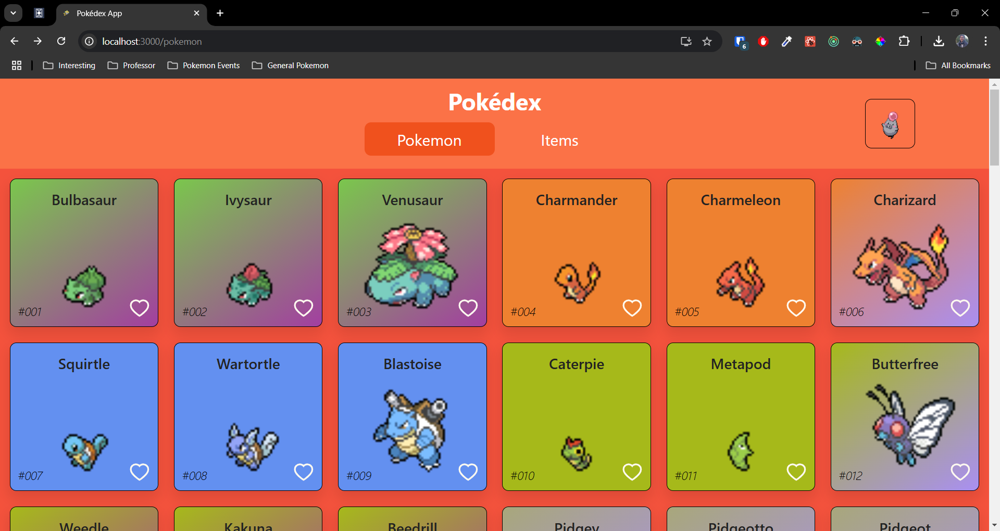

# Pokedex app for testing

The purpose of this app was to test and learn new things working with React TypeScript. The application is very rough for styles and was purely a technical demo.

## Example technology used in this demo

- **React functional components**
- **React styled components**
- **React Spring**
- **Redux**
- **TypeScript**
- **Axios**
- **Webpack**
- **Babel**

## Screenshots

App homepage

